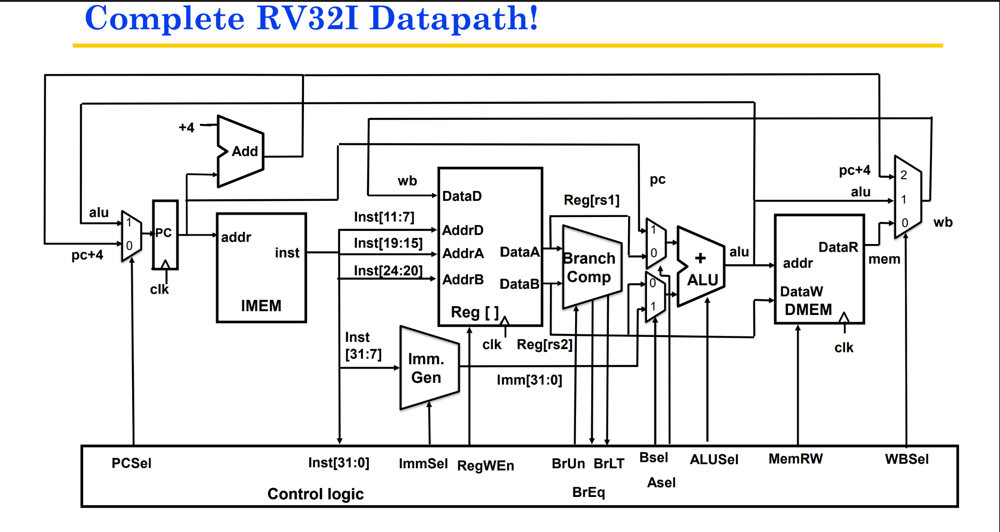

# Logism_a-single-cycle-RISCV_processor_design
Single-Cycle RISC-V Processor Design  A complete single-cycle 32-bit RISC-V processor implemented in **Logisim-Evolution**.
# Single-Cycle 32-Bit RISC-V Processor Design

A complete 32-bit RISC-V CPU core designed and implemented using **Logisim-Evolution**.

## Overview
This project features a fully functional single-cycle RISC-V processor that fetches, decodes, and executes core integer instructions in a single clock cycle.

## Supported Instruction Types
- **R-Type**: Core arithmetic and logical operations (`add`, `sub`, `and`, `or`, `slt`)
- **I-Type**: Immediate arithmetic and memory load operations (`addi`, `lw`)
- **S-Type**: Memory store operations (`sw`)
- **B-Type**: Conditional branch operations (`beq`, `bne`)
- **J-Type / U-Type**: Jump and upper immediate operations (`jal`, `lui`)

## Circuit Architecture

### Key Modules
- **32-Bit ALU**: Implements arithmetic, logical bitwise operations, and flags.
- **Register File**: 32 general-purpose registers (`x0` hardwired to `0`).
- **Control Unit**: Decodes opcodes and funct bits to drive datapath control signals.
- **Memory Units**: Separate instruction memory and data memory.

## How to Run
1. Open **Logisim-Evolution**.
2. Go to **File > Open** and select `RiscV-32_processor.circ`.
3. Right-click the **Instruction Memory** component to load your compiled machine code (`.hex` file).
4. Enable the clock by selecting **Simulate > Auto-Tick Enabled** (or press `Ctrl + K`).
